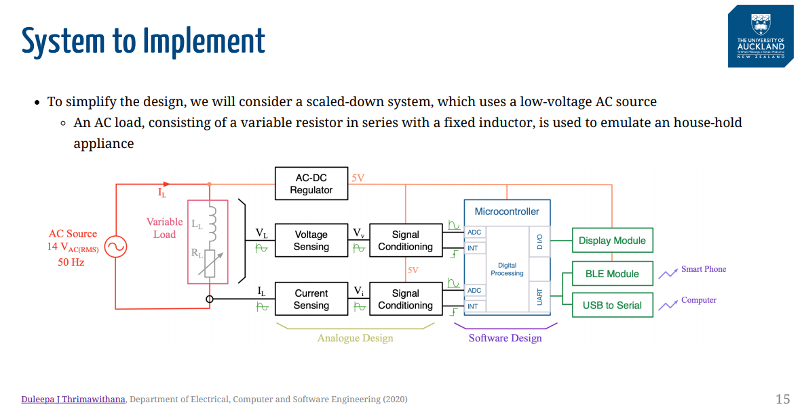
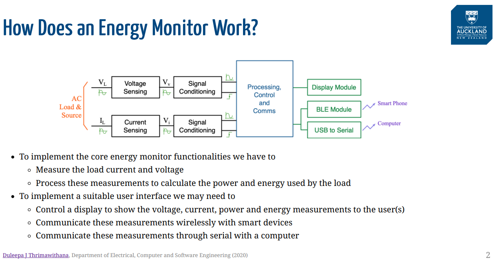
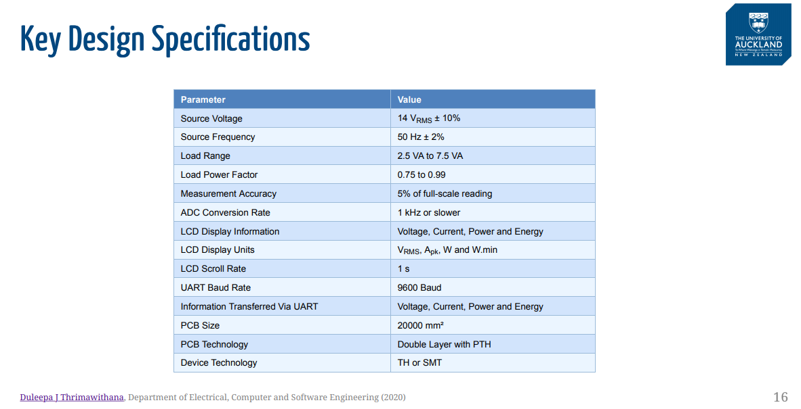
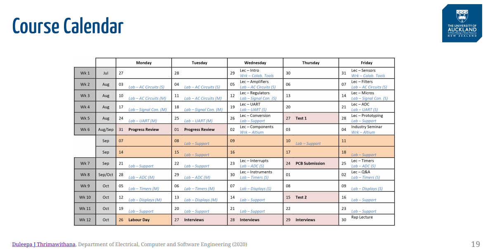
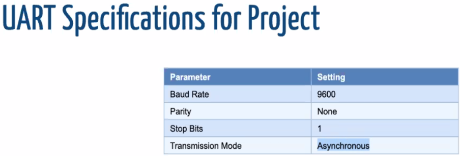
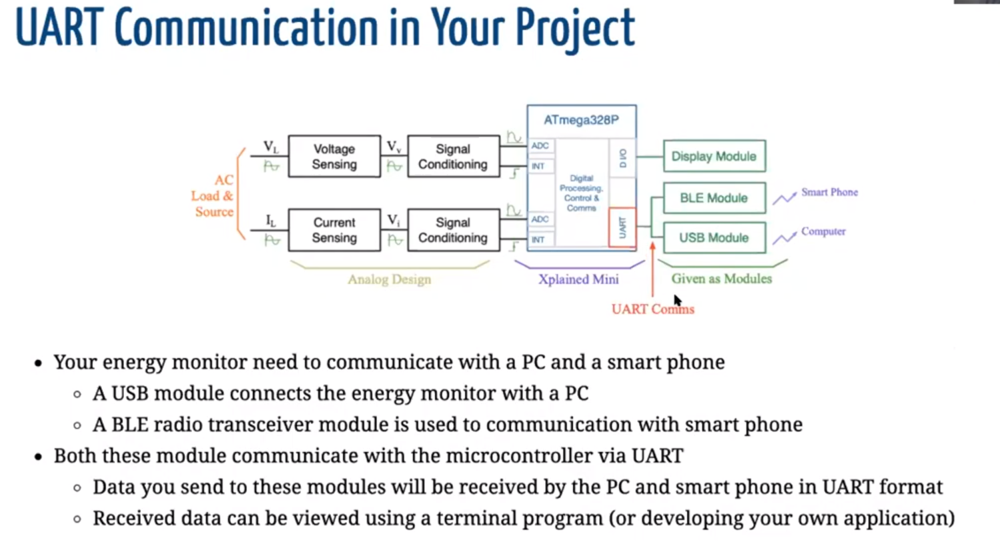
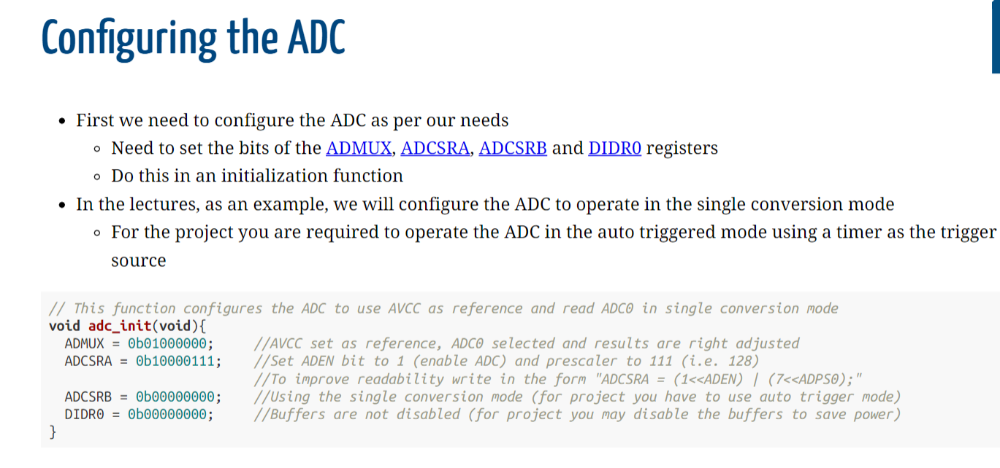
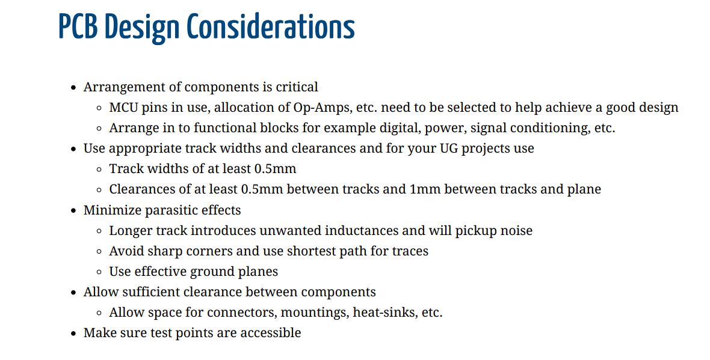

---
# use Pandoc to convert to .pdf / .html file
#	.e.g pandoc ProjectSpecs.md -o ProjectSpecs.pdf
#	.e.g pandoc ProjectSpecs.md -o ProjectSpecs.html
# or just run `make` in the current directory, and the Makefile will
#	build the .pdf file for you (assuming you have pandoc installed).
documentclass: article
geometry: margin=20mm
fontsize: 16pt
---

# ENGGEN209 - Team 2 - Project Specifications:

## Overview Of System To Impliment:

## Key Design Specifications:

## Planner

\newpage{}

## Circuitry to sense the voltage and current supplied to the load:
- Signal conditioning circuitry to amplify and filter the sensed voltage and current signals.
- A software-based digital processing system, which uses an ATmega328P microcontroller, to convert
the analogue signals provided by the signal conditioning circuit to digital form and calculate the voltage,
current, power and energy.
- AC to DC regulator circuitry to generate a 5 V DC supply for the analogue (and digital) circuitry
employed in the energy monitor.
- A 7-segment LCD display module, which is connected to the microcontroller via a shift-register, to
show the calculated information.
- A Bluetooth LE module, which is connected to the microcontroller via Universal Asynchronous
Receiver/Transmitter (UART), to communicate information with a smart device like a phone.
- A USB interface with serial emulation, which is connected to the microcontroller via UART, to
communicate information with a laptop/PC.

## Provided Items
- The source configuration circuit.
- An Xplained Mini 328PB microcontroller module with headers providing easy access to the ports
- An HM-10 Bluetooth LE module which contains a CC2540 system-on-chip (SoC) and associated
circuitry needed to interface directly with the UART port of the microcontroller
- A 4-digit seven-segment LCD display module which contains a 74HC595 shift-register and the logic
circuitry required to interface with digital IO pins of the microcontroller.

## Bluetooth Module UART Specs:

## UART Communication Specifications:

# ADC Register Configuration:

# PCB Design Considerations:

